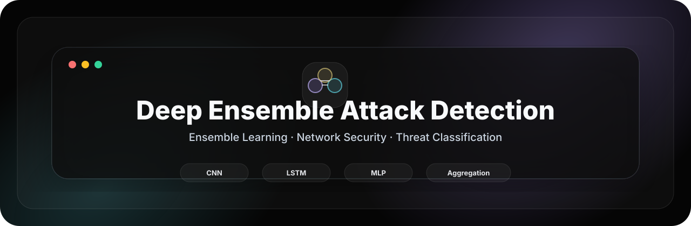
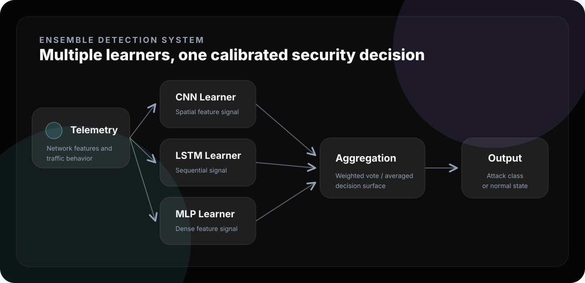
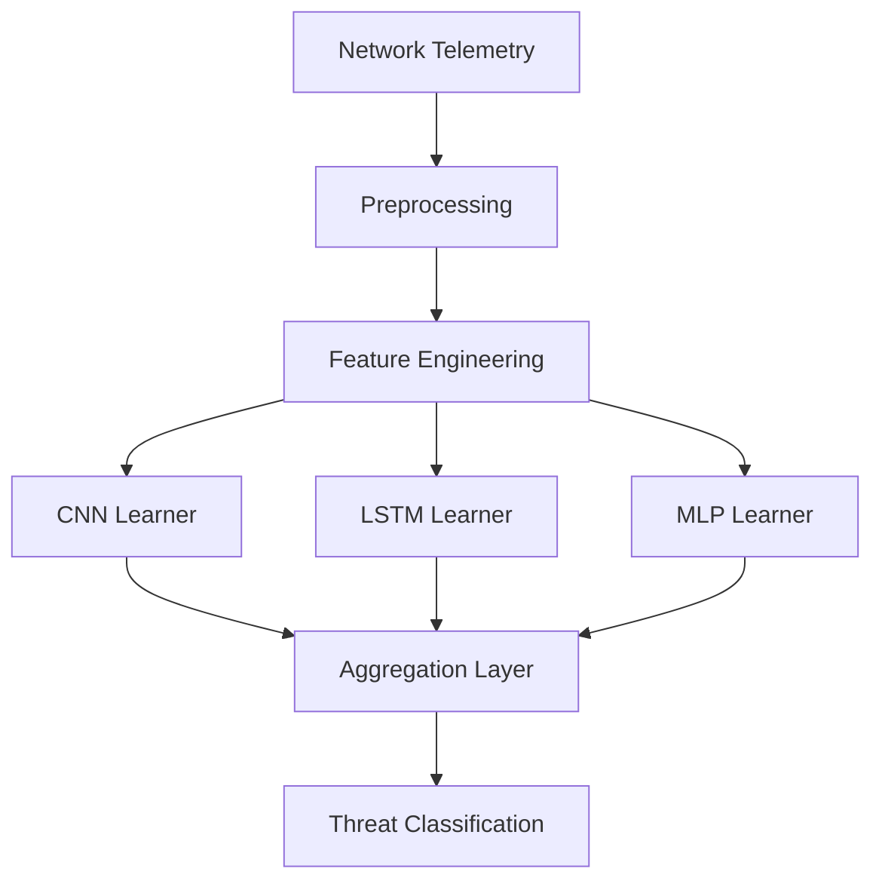
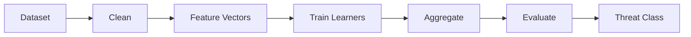

<div align="center">



<br />

<p>
  <strong>Combine learners.</strong> <strong>Reduce variance.</strong> <strong>Classify network threats.</strong>
</p>

<p>
  
  
  
  
</p>

</div>

---

<div align="center">

<table>
<tr>
<td align="center" width="25%"><strong>Domain</strong><br />Network Security</td>
<td align="center" width="25%"><strong>Pattern</strong><br />Deep Ensemble</td>
<td align="center" width="25%"><strong>Mode</strong><br />Research Notebook</td>
<td align="center" width="25%"><strong>Output</strong><br />Threat Class</td>
</tr>
</table>

</div>

---

## 01 · Overview

<table>
<tr>
<td width="58%" valign="top">

### Ensemble-based threat classification for network security

This repository presents a deep ensemble framework for network attack detection. The system is designed around multiple model learners whose outputs are combined to produce a more stable and reliable classification decision.

The research direction is focused on reducing single-model overconfidence and improving robustness across noisy or high-dimensional traffic data.

</td>
<td width="42%" valign="top">

```text
┌──────────────────────────────┐
│  DEEP ENSEMBLE DETECTOR      │
├──────────────────────────────┤
│  Input      Network Features │
│  Learners   CNN / LSTM / MLP │
│  Fusion     Aggregation      │
│  Output     Threat Decision  │
│  Mode       Research Lab     │
└──────────────────────────────┘
```

</td>
</tr>
</table>

---

## 02 · Ensemble Architecture



---

## 03 · Detection Workflow



---

## 04 · Key Features

| Feature | Purpose |
|---|---|
| Ensemble architecture | Combines multiple learners for a stronger decision surface. |
| Model diversity | Uses different model families to capture different traffic patterns. |
| Aggregated inference | Fuses learner outputs into a final threat classification. |
| Research notebook flow | Supports experimentation, evaluation, and model comparison. |
| Security-focused framing | Targets network attack detection and anomaly classification. |
| Portfolio-ready system design | Presents the project as a mature AI security research prototype. |

---

## 05 · ML Pipeline



| Stage | Output |
|---|---|
| Data preparation | Cleaned network traffic records. |
| Feature engineering | Model-ready traffic vectors. |
| Learner training | Independent deep / neural classifiers. |
| Aggregation | Combined ensemble decision. |
| Evaluation | Accuracy, precision, recall, F1-score, confusion matrix. |

---

## 06 · Installation

```bash
git clone https://github.com/ns7523/Deep-Ensemble-Attack-Detection.git
cd Deep-Ensemble-Attack-Detection
python -m venv .venv
source .venv/bin/activate
pip install notebook pandas numpy scikit-learn matplotlib seaborn tensorflow
```

---

## 07 · Usage

Launch Jupyter:

```bash
jupyter notebook
```

Run the workflow in order:

```text
1. Load dataset
2. Preprocess features
3. Train ensemble learners
4. Aggregate predictions
5. Evaluate detection performance
```

---

## 08 · Project Structure

```text
.
├── assets/
│   └── brand/
│       ├── ensemble.svg
│       └── hero.svg
├── notebooks/
└── README.md
```

Suggested production structure:

```text
docs/ · src/ · models/ · data/ · results/ · notebooks/ · assets/screenshots/ · requirements.txt
```

---

## 09 · Visual Assets

<table>
<tr>
<td width="50%" valign="top">

### Ensemble Architecture

`assets/screenshots/ensemble-architecture.png`

Model flow showing learner branches and aggregation.

</td>
<td width="50%" valign="top">

### Metrics Report

`assets/screenshots/model-metrics.png`

Accuracy, precision, recall, F1-score, and confusion matrix.

</td>
</tr>
<tr>
<td width="50%" valign="top">

### Notebook Workflow

`assets/screenshots/notebook-workflow.png`

Training and evaluation cells from the research notebook.

</td>
<td width="50%" valign="top">

### Prediction Output

`assets/screenshots/prediction-output.png`

Final classification output from the ensemble detector.

</td>
</tr>
</table>

---

## 10 · Future Improvements

- [ ] Add a pinned `requirements.txt`.
- [ ] Move training and evaluation logic into `src/`.
- [ ] Add model artifacts under `models/`.
- [ ] Add benchmark metrics under `results/`.
- [ ] Add screenshots under `assets/screenshots/`.
- [ ] Document aggregation strategy in `docs/methodology.md`.
- [ ] Add a formal open-source license.

---

<div align="center">

### N S Akash

**AI & Cybersecurity Engineer**

<p>
  <a href="https://github.com/ns7523"></a>
  <a href="https://nsakash.in"></a>
  <a href="mailto:contact@nsakash.in"></a>
  <a href="https://www.linkedin.com/in/nsakash7523"></a>
</p>

</div>
