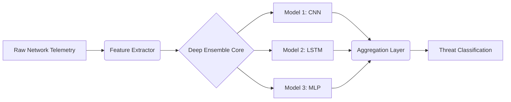

<div align="center">
  <br />
  
  <br />

  <h1 align="center">Deep Ensemble Attack Detection</h1>

  <p align="center">
    <strong>Deep Ensemble-based Efficient Framework for Network Attack Detection.</strong>
  </p>

  <p align="center">
    
    
    
  </p>
</div>

<br />

## Overview

This research repository introduces a highly efficient Deep Ensemble machine learning framework engineered specifically for complex network attack detection. By aggregating predictive distributions across multiple deep learning topologies, the system significantly improves robustness against adversarial perturbations and zero-day intrusion signatures.

### Engineering & Research Significance
Single-model intrusion detection systems suffer from high variance and overconfidence on out-of-distribution network traffic. This architecture leverages ensemble methodologies to calibrate uncertainty, yielding a more reliable security posture for enterprise-grade network monitoring.

<br />

## Architecture Pipeline



<br />

## Core Features

- **Ensemble Aggregation**: Fuses spatial and temporal feature learning utilizing disparate neural architectures.
- **Uncertainty Calibration**: Improves the system's ability to flag anomalous, previously unseen traffic types for manual review.
- **High-Fidelity Feature Selection**: Minimizes inference latency without sacrificing detection accuracy.

<br />

## Quick Start

### Prerequisites
- Python 3.8+
- Jupyter Notebook / JupyterLab environment.

### Usage

```bash
# Clone the repository
git clone https://github.com/ns7523/Deep-Ensemble-Attack-Detection.git
cd Deep-Ensemble-Attack-Detection

# Launch Jupyter environment
jupyter notebook
```
Navigate to the primary `.ipynb` file to execute the training and evaluation cells.

<br />

<div align="center">
  <br />
  <sub>Security Architecture by <a href="https://github.com/ns7523">N S AKASH</a></sub>
</div>
